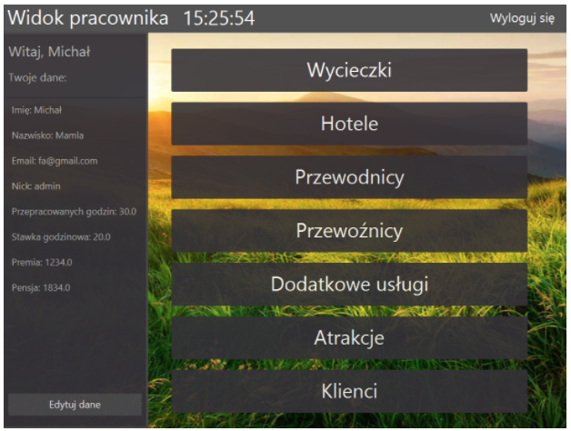

# TravelAgencyClient
University database project of Travel Agency from client side.

# Prerequirements

Intellij Idea -> Run -> Edit configuration -> Build and run

--module-path   
"C:\Program Files\Java\javafx-sdk-11.0.2\lib" {paste your directory of javafx here}   
--add-modules   
javafx.controls,javafx.fxml   
--add-opens   
javafx.graphics/javafx.css=ALL-UNNAMED   

Add libraries:
* de.jensd.fontawesomefx-fontawesome
* de.jensd.fontawesomefx-commons
* org.controlsfx.controlsfx 

to SceneBuilder program via SceneBuilder -> Gear Icon -> Jar/FXML Manager -> Search repositories

## Screenshots

  
  
  
  
  
  

